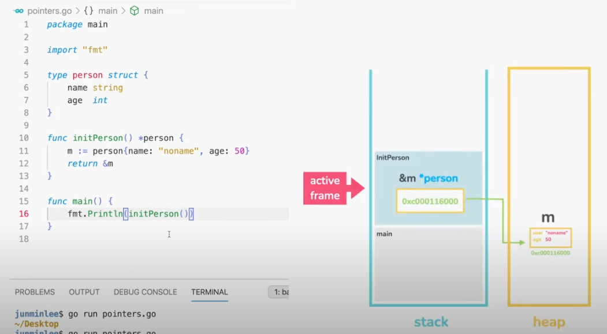

# Go compendium
Go language compendium

---
### Why Go?

- **Built-in Concurrency Mechanism** that was **designed to run on multiple cores** and to support concurrency.
- **Concurrency is cheap and easy** compared to other languages like C++ or Java.
- For **Performant** applications and running on **scaled, distributed systems**.
- E.g. *Docker and K8s* are written in GO.
- Faster than interpreted languages like Python. 


---
### Why Go Modules Replace GOPATH:

Go modules use the `go.mod` file to manage dependencies for each project, and you can create Go projects anywhere in your file system, not just within the `GOPATH` directory.
Each project is self-contained, meaning that each project has its own module file (`go.mod`) to manage its dependencies independently of other projects.

*By default, `GOPATH` is set to `~/go`, but this is only relevant if you're using legacy projects that rely on the `GOPATH` structure*.
For modern Go development using modules, there's no need to manually manage `GOPATH` unless you're working on older projects.

Only need to set `GOPATH` in the following cases:
- You're working on older Go projects that still rely on the `GOPATH` workspace model.
- You prefer to have a central location where Go binaries (go install) and packages are installed, *but even this is optional since modules handle dependencies locally*.


---
### Go Commands summary:

| **Command**           | **Usage**                          | **Description**                                                                 | **Example**                                                                 |
|-----------------------|------------------------------------|---------------------------------------------------------------------------------|-----------------------------------------------------------------------------|
| `go mod init`         | `go mod init module-name`           | Initializes a new Go module. Creates a `go.mod` file for dependency management. | `go mod init github.com/yourusername/gocomp`                                |
| `go mod tidy`         | `go mod tidy`                       | Cleans up `go.mod` and `go.sum` by removing unused dependencies and adding missing ones. | `go mod tidy`                                                               |
| `go build`            | `go build [package]`                | Compiles Go source code into an executable binary.                              | `go build` (builds the project in the current directory)                    |
| `go run`              | `go run file.go`                    | Compiles and runs the specified Go source file(s).                              | `go run main.go`                                                            |
| `go test`             | `go test [package]`                 | Runs tests in the specified package or directory.                               | `go test ./...` (runs all tests in the current directory and subdirectories)|
| `go fmt`              | `go fmt [files or packages]`        | Formats Go source code according to the standard Go style.                       | `go fmt ./...` (formats all Go files in the current directory and subdirectories) |
| `go get`              | `go get package`                    | Downloads and installs the specified package along with its dependencies.       | `go get github.com/some/package`                                            |
| `go install`          | `go install package`                | Compiles and installs the specified Go package.                                 | `go install github.com/yourusername/gocomp` (installs the `gocomp` package) |
| `go list`             | `go list [package]`                 | Lists Go packages, including their module path and metadata.                    | `go list github.com/yourusername/gocomp`                                    |
| `go mod edit`         | `go mod edit -require=module@version` | Edits the `go.mod` file to add or remove dependencies.                          | `go mod edit -require=github.com/some/package@v1.2.3`                      |
| `go env`              | `go env`                            | Displays Go environment variables and configuration.                            | `go env`                                                                     |
| `go doc`              | `go doc [package]`                  | Displays documentation for the specified package or symbol.                     | `go doc github.com/yourusername/gocomp`                                     |
| `go version`          | `go version`                        | Shows the installed Go version.                                                  | `go version`                                                                 |
| `go mod why`          | `go mod why package`                | Explains why a specific module is needed by your module.                        | `go mod why github.com/some/package`                                        |
| `go mod vendor`       | `go mod vendor`                     | Creates a `vendor` directory with copies of all dependencies for offline builds. | `go mod vendor`                                                              |


---
### Module paths for downloadable packages

If you’re creating a project which can be downloaded and used by other people and programs, then it’s good practice for your module path to equal the location that the code can be downloaded from.

For instance, if your package is hosted at https://github.com/foo/bar then the module path for the project should be github.com/foo/bar.


---
### Packages, Variables, and Constants:

- All code must belong to **packages**, i.e. all code is organized in **packages**. The first statement in a file should be a package declaration. **A package is a set of related source files** with their functions, e.g. [`fmt`](https://pkg.go.dev/fmt) and its functions to print in different formats like `Println` or `Printf` using printing verbs like `%v`, `%s`, `%d`, `%t`, etc.
- **Variables** are used to store values and reuse/update values like *containers*. Variables are declared with the `var` keyword.
- **Go Compile Errors to enforce better code quality**, e.g. leaving a `var` without a call/usage highlights an error (variables must be used) or trying to update a `const` value from 50 to 30. 
- **Go is a Statically Typed** language, i.e. Go Compiler will throw an error if a variable is not declared with a type, this is called **Type Checking**, unless the type of the variable could be inferred from its assigned value during the declaration, e.g. `a := 10`, `var a = 10`, `var a int = 10` are valid declarations in Go but `var a // declaration without assignment and after few lines of code being assigned with a = 10` is an error. 
**Type Inference** is when Go compiler infers the type of variable based on the assigned value. *Note `:=` can only be used in variables and NO to `const`*


---
### Data Types:

| Data Type   | Description                                  | Example                                  |
|-------------|----------------------------------------------|------------------------------------------|
| **bool**    | Represents a Boolean value (true or false).  | `var isActive bool = true`               |
| **string**  | Sequence of characters.                      | `var name string = "GoLang"`             |
| **int**     | Signed integer (size depends on platform).   | `var age int = 30`                       |
| **int8**    | 8-bit signed integer (-128 to 127).          | `var smallNum int8 = -10`                |
| **int16**   | 16-bit signed integer (-32,768 to 32,767).   | `var mediumNum int16 = 300`              |
| **int32**   | 32-bit signed integer (-2^31 to 2^31-1).     | `var largeNum int32 = 100000`            |
| **int64**   | 64-bit signed integer (-2^63 to 2^63-1).     | `var bigNum int64 = 100000000000`        |
| **uint**    | Unsigned integer (size depends on platform). | `var index uint = 10`                    |
| **uint8**   | 8-bit unsigned integer (0 to 255).           | `var byteVal uint8 = 255`                |
| **uint16**  | 16-bit unsigned integer (0 to 65,535).       | `var smallIndex uint16 = 500`            |
| **uint32**  | 32-bit unsigned integer (0 to 4,294,967,295).| `var mediumIndex uint32 = 100000`        |
| **uint64**  | 64-bit unsigned integer (0 to 2^64-1).       | `var largeIndex uint64 = 1000000000`     |
| **float32** | 32-bit floating-point number.                | `var price float32 = 9.99`               |
| **float64** | 64-bit floating-point number.                | `var pi float64 = 3.14159`               |
| **complex64** | Complex number with float32 real and imaginary parts. | `var c complex64 = 2 + 3i`      |
| **complex128**| Complex number with float64 real and imaginary parts. | `var c complex128 = 2 + 3i`   |
| **byte**    | Alias for `uint8`, represents a byte.        | `var b byte = 255`                       |
| **rune**    | Alias for `int32`, represents a Unicode character. | `var char rune = 'A'`               |
| **array**   | Fixed-size sequence of elements of the same type. | `var nums [3]int = [3]int{1, 2, 3}`   |
| **slice**   | Dynamic-size sequence of elements of the same type. | `var nums []int = []int{1, 2, 3}`   |
| **map**     | Key-value pairs, where keys and values can be of any type. | `var dict map[string]int = map[string]int{"a": 1}` |
| **struct**  | Collection of fields.                        | `type Person struct { Name string; Age int }` |
| **pointer** | Holds the memory address of a value.         | `var ptr *int = &age`                    |
| **interface** | Abstract type to represent any type.       | `var i interface{} = "hello"`            |
| **function** | A function signature with parameters and return values. | `func add(a int, b int) int { return a + b }` |


---
### Pointers:

Variables are stored in memory but when we reference a variable we are actually pointing to its memory address, i.e.
**a Pointer is a Variable that points to the Memory Address of another Variable** -*special variable* that holds the memory address of the other variable, e.g. printing a pointer returns the memory address of the variable pointed while printing a variable returns the actual value.


```go
fmt.Println("Pointer of soldTickets is", &soldTickets, "and its Variable value", soldTickets)	
```	
```text
// output console
Pointer of soldTickets is 0xc0000ac00b and its Variable value 20
```


---
### Arrays and Slices:

**Arrays and Slices** are data structures to **store collections of elements in a Single Variable**.

- **An Array has a Fixed size**, i.e. how many elements the array can hold, 
e.g. `var nums [3]int`, `var nums = [3]int{1, 2, 3}`, `var nums = [3]int{1}` and `var nums = [3]int{}` are valid declarations.
**Arrays are indexed starting from 0**, e.g. `nums[0] = 1` and `nums[1] = 10`. Examples of updating an array inside a function: 
```go
func main() {
    var conferenceName = "Go Conference"
    const totalTickets uint8 = 50
    var remainingTickets uint8 = 30
    soldTickets := calculateSoldTickets(remainingTickets, totalTickets)
    var bookings [totalTickets]string
    initBookings(totalTickets, soldTickets, &bookings)
    // ... more code here
}

// Must pass booking Pointer otherwise array will be passed by copy and original array values won't be updated.
// An alternative approach is to return the copy of the bookings array and then replacing the original after the function is called.
func initBookings(totalTickets uint8, soldTickets uint8, bookings *[50]string) {
    for i := 0; i < int(totalTickets); i++ {
        if i < int(soldTickets) {
            // must update the actual array value not the pointer, i.e. doing dereference:
            (*bookings)[i] = "SOLD"
        } else {
            // Go has syntactic sugar that simplifies working with pointers to arrays.
            // When you use bookings[i], Go automatically dereferences the pointer for you to access the array element,
            // so you don’t need to explicitly write (*bookings)[i].
            bookings[i] = "AVAILABLE"
        }
    }
}
```

- **Slice is an abstraction of Array that has Dynamic size**, more flexible and powerful, i.e. slices are also **index-based** and **have a size, but is Resized when Needed**. More flexible and powerful than arrays, i.e. **Variable-length** or get a sub-array of its own.
Valid declarations of Slices are `var bookings []string`, `var bookings = []string{}` or `bookings := []string{}` never specifying the size. Also, **using `make()` to declare slices in Go is considered good practice because it allows you to initialize slices with a specific length and capacity, which improves memory management and performance**, e.g.: `var bookings = make([]string, 20, 50) // len=20 and cap=50`.
```go
func main() {
	var conferenceName = "Go Conference"
	const totalTickets uint8 = 50
	var remainingTickets uint8 = 30
	soldTickets := calculateSoldTickets(remainingTickets, totalTickets)
	bookings := make([]string, 0, totalTickets)                  // len=0, cap=50
	bookings = initBookings(totalTickets, soldTickets, bookings) // len=20, cap=50
    // more code here
}

// Bookiing Slice by reference, i.e. the Slice Descriptor pointing to the underlying array.
func initBookings(totalTickets uint8, soldTickets uint8, bookings []string) []string {
	for i := 0; i < int(totalTickets); i++ {
		if i < int(soldTickets) {
			// The append built-in function appends elements to the end of a slice.
			// If it has sufficient capacity, the destination is resliced to accommodate the new elements.
			// If it does not, a new underlying array will be allocated
			bookings = append(bookings, "SOLD")
		} else {
			// leave empty avaialble indexes so the len can be smaller that the slice capacity.
			break
		}
	}
	return bookings
}
```	

⚠️ **Note passing a Slice as a parameter is different from passing an Array as a parameter as GO passes Slices by Reference and Arrays by Value**, i.e.:

**1. Slices Are Passed by Reference**

**A slice in Go is a descriptor** that contains:
- **A pointer to the underlying array**.
- A length (the number of elements in the slice).
- A capacity (the size of the underlying array).

When you pass a slice to a function, Go passes this descriptor (which includes the pointer to the underlying array). This means:
- **Modifications to the slice elements inside the function** will affect the original slice since it references the same underlying array.
- The slice header (pointer, length, capacity) itself is passed by value, but the pointer still points to the same underlying array, allowing shared access to the elements.

Example:
```go
func modifySlice(s []int) {
    s[0] = 100 // This modifies the original array
}

func main() {
    numbers := []int{1, 2, 3}
    modifySlice(numbers) // Modifies the original slice
    fmt.Println(numbers) // Output: [100 2 3]
}
```

**2. Arrays Are Passed by Value**

In contrast, when you pass an array to a function, Go passes **a copy** of the entire array. This means:
- Modifications to the array inside the function will not affect the original array outside the function because the function is working with a **copy** of the original array.
- **Arrays are fixed in size and passing them can be inefficient for large arrays since the entire array is copied**.

Example:
```go
func modifyArray(a [3]int) {
    a[0] = 100 // Modifies only the copy of the array
}

func main() {
    numbers := [3]int{1, 2, 3}
    modifyArray(numbers) // Passes a copy of the array
    fmt.Println(numbers) // Output: [1 2 3] - Original array is unchanged
}
```

**Key Differences Between Array and Slice in General:**

| Aspect               | Slice                                      | Array                                       |
|----------------------|--------------------------------------------|---------------------------------------------|
| **Passing Behavior**  | Passed by reference (pointer to array)     | Passed by value (entire array is copied)    |
| **Size**              | Dynamic, can change size (flexible length) | Fixed size (defined at declaration)         |
| **Modification**      | Changes inside the function affect original | Changes inside the function affect only the copy |
| **Efficiency**        | More efficient for large data since only the descriptor is passed | Less efficient for large arrays as the entire array is copied |
| **Underlying Data**   | Slices reference an underlying array       | Arrays do not have a separate underlying structure |
| **Use Case**          | Preferred when working with collections of unknown or variable size | Used for fixed-size collections              |

**Key Differences Between Array and Slice 'Length':**

| Aspect              | Array                                        | Slice                                      |
|---------------------|----------------------------------------------|--------------------------------------------|
| **Size**            | Fixed size, set at declaration.              | Dynamic size, can grow or shrink.          |
| **`len()` Result**  | Always returns the fixed size of the array.  | Returns the current number of elements.    |
| **Mutability**      | The length cannot be changed after creation. | The length can change as elements are added or removed. |
| **Capacity**        | The length is equals to the Capacity, as it's a fixed size.| Capacity is separate from length and can be larger than the length. |


---
## Loops

A **loop** statement allows you to **execute a block of code multiple times**, in a loop.

**Loops are simplified in GO providing only one of them to use it for every possible case**, i.e. `for` loop -No `while`, `do-while` or `for-each` loops exist.
- **Infinite case**:
```go
for {
    // infinite loop
}
```
- **For by Index case**:
```go
for index := 0; index < 10; index++ {
    fmt.Println(index)
}
```
- **For Range case (for each)**:
Range **iterates over elements for different data structures** (not only arrays and slices).
In array and slices, **range provides the Index and the Value 'for each' element**, i.e.: 
```go
for index, value := range array {
    fmt.Println(i, v)
}  
```
⚠️ Note in go `_` is also known as **Blank identifier** so in case of requiring the Value without the Index setting `_` instead of `index` is a valid sentence, i.e.:
```go
for _, value := range array {
    fmt.Println(v)
}  
```


---
## Conditionals

The **expression that evaluate** to either `true` or `false` **is called a condition**.

**`if-else`:**
```go
if condition {
    // code to execute if condition is true
} else if anotherCondition {
    // code to execute if anotherCondition is true
} else {
    // code to execute if none of the above conditions are true
}
```

**Short Statement with Condition:**

You can also include a short statement before the condition, i.e. ⚠️ **declare a variable in the same line as `if`**:

```go
if y := 5; y > 0 {
    fmt.Println("y is positive")
}
```

Here, `y` is declared and initialized only within the scope of the `if` block.

⚠️ A `true` or `false` boolean conditional can also be applied to **loops**, e.g.:
```go
// infinite loop for ==> for "true", i.e.: 
for { }
	
// loop with true false condition:
for remainingTickets > 0 { }
```


---
## Operators

1. **Arithmetic Operators**

| **Operator** | **Description**     | **Example**        | **Explanation**                                 |
|--------------|---------------------|--------------------|-------------------------------------------------|
| `+`          | Addition             | `x + y`            | Adds `x` and `y`.                               |
| `-`          | Subtraction          | `x - y`            | Subtracts `y` from `x`.                         |
| `*`          | Multiplication       | `x * y`            | Multiplies `x` by `y`.                          |
| `/`          | Division             | `x / y`            | Divides `x` by `y`.                             |
| `%`          | Modulo               | `x % y`            | Remainder of `x` divided by `y`.                |

2. **Comparison Operators**

| **Operator** | **Description**       | **Example**        | **Explanation**                                 |
|--------------|-----------------------|--------------------|-------------------------------------------------|
| `==`         | Equal to               | `x == y`           | True if `x` is equal to `y`.                    |
| `!=`         | Not equal to           | `x != y`           | True if `x` is not equal to `y`.                |
| `>`          | Greater than           | `x > y`            | True if `x` is greater than `y`.                |
| `<`          | Less than              | `x < y`            | True if `x` is less than `y`.                   |
| `>=`         | Greater than or equal  | `x >= y`           | True if `x` is greater than or equal to `y`.    |
| `<=`         | Less than or equal     | `x <= y`           | True if `x` is less than or equal to `y`.       |

3. **Logical Operators**

| **Operator** | **Description**         | **Example**        | **Explanation**                                         |
|--------------|-------------------------|--------------------|---------------------------------------------------------|
| `&&`         | Logical AND              | `x > 0 && y < 10`  | True if both conditions are true.                       |
| `\|\|`         | Logical OR               | `x > 0 \|\| y < 10`  | True if at least one condition is true.                 |
| `!`          | Logical NOT              | `!x`               | Negates the condition (true becomes false, and vice versa). |

4. **Bitwise Operators**

| **Operator** | **Description**         | **Example**        | **Explanation**                                      |
|--------------|-------------------------|--------------------|------------------------------------------------------|
| `&`          | Bitwise AND              | `x & y`            | Performs AND on each pair of bits.                   |
| `\|`          | Bitwise OR               | `x \| y`            | Performs OR on each pair of bits.                    |
| `^`          | Bitwise XOR              | `x ^ y`            | Performs XOR on each pair of bits.                   |
| `&^`         | AND NOT (bit clear)      | `x &^ y`           | Clears bits of `x` where `y` is 1.                   |
| `<<`         | Left shift               | `x << 2`           | Shifts `x` to the left by 2 bits (multiply by 4).     |
| `>>`         | Right shift              | `x >> 2`           | Shifts `x` to the right by 2 bits (divide by 4).      |

5. **Assignment Operators**

| **Operator** | **Description**          | **Example**         | **Explanation**                                        |
|--------------|--------------------------|---------------------|--------------------------------------------------------|
| `=`          | Assignment                | `x = y`             | Assigns the value of `y` to `x`.                       |
| `+=`         | Add and assign            | `x += y`            | Adds `y` to `x` and assigns the result to `x`.         |
| `-=`         | Subtract and assign       | `x -= y`            | Subtracts `y` from `x` and assigns the result to `x`.  |
| `*=`         | Multiply and assign       | `x *= y`            | Multiplies `x` by `y` and assigns the result to `x`.   |
| `/=`         | Divide and assign         | `x /= y`            | Divides `x` by `y` and assigns the result to `x`.      |
| `%=`         | Modulo and assign         | `x %= y`            | Finds the remainder of `x` divided by `y`, assigns it to `x`. |
| `&=`         | Bitwise AND and assign    | `x &= y`            | Performs bitwise AND and assigns the result to `x`.    |
| `\|=`         | Bitwise OR and assign     | `x \|= y`            | Performs bitwise OR and assigns the result to `x`.     |
| `^=`         | Bitwise XOR and assign    | `x ^= y`            | Performs bitwise XOR and assigns the result to `x`.    |
| `<<=`        | Left shift and assign     | `x <<= 2`           | Shifts `x` left by 2 bits and assigns the result to `x`. |
| `>>=`        | Right shift and assign    | `x >>= 2`           | Shifts `x` right by 2 bits and assigns the result to `x`. |

6. **Miscellaneous Operators**

| **Operator** | **Description**         | **Example**         | **Explanation**                                        |
|--------------|-------------------------|---------------------|--------------------------------------------------------|
| `++`         | Increment               | `x++`               | Increases `x` by 1 (post-increment).                   |
| `--`         | Decrement               | `x--`               | Decreases `x` by 1 (post-decrement).                   |


---
## Memory Stack and Heap
In Go, memory management is straightforward thanks to its garbage collector, but understanding how stack and heap memory work can still be useful:

**Memory Stack**

- **Purpose**: The stack is used for managing function calls, local variables, and control flow.
- **Structure**: Operates in a **Last-In-First-Out (LIFO)** manner. Each function call pushes a new **frame** onto the stack, and **the frame is removed when the function returns**.
- **Usage**:
  - **Function Frames**: Stores local variables and function parameters.
  - **Automatic Allocation**: Local variables and parameters are allocated on the stack.
- **Characteristics**:
  - **Size**: Typically limited in size (stack size is managed by the Go runtime).
  - **Allocation/Deallocation**: Fast and automatic. The Go runtime manages this.
  - **Lifetime**: Memory is reclaimed automatically when the function returns.

**Heap**

- **Purpose**: The heap is used for **dynamic memory allocation**. Objects and data structures that need to persist beyond the scope of function calls are allocated here, e.g. **pointer**.
- **Structure**: The heap allows for more flexible allocation and deallocation. Memory is managed by the Go runtime's garbage collector.
- **Usage**:
  - **Dynamic Allocation**: Used for data that needs to live beyond the lifetime of a single function call or needs to be shared among different parts of a program.
  - **Garbage Collection**: Go automatically manages memory allocation and deallocation, so you don't need to manually free memory. The garbage collector reclaims memory that is no longer in use.
- **Characteristics**:
  - **Size**: Typically larger and more flexible compared to the stack.
  - **Allocation/Deallocation**: Handled by the garbage collector, which may introduce some overhead.
  - **Lifetime**: Managed automatically; memory is freed when there are no references to it.

Here are 2 examples illustrating stack and heap usage:

```go
package main

import "fmt"

func main() {
    a := 10      // Stack allocation
    b := &a      // Heap allocation (a reference to stack variable `a`)

    fmt.Println(a) // Stack
    fmt.Println(*b) // Dereferencing heap reference
}
```



***Summary***

- **Stack**: Used for local variables and function call management. Automatic and fast allocation/deallocation.
- **Heap**: Used for dynamic data and objects that persist beyond function scopes. Managed by Go’s garbage collector, which automates memory management but may add overhead.

Understanding how Go handles memory can help you write more efficient and effective code, especially when working with large data structures or managing performance.